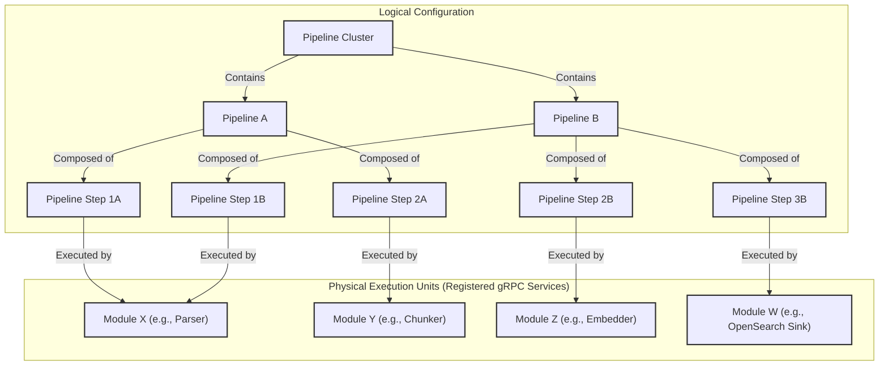
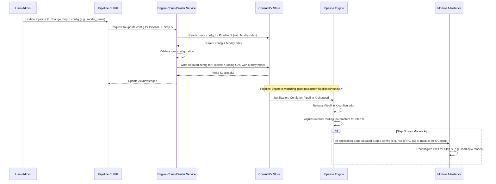

# Pipeline Engine: Pipeline Design

## Network Graph Architecture

The Pipeline Engine implements a network graph architecture for data processing workflows, similar to DNS resolution. Rather than linear pipelines, the system operates as a distributed network where data flows through interconnected nodes (modules) based on routing decisions. This design provides maximum flexibility, modularity, and scalability.

## Logical Design Hierarchy

The main components of this hierarchy are: Clusters, Pipelines, Pipeline Steps, and Modules.



1.  **Pipeline Clusters (`PipelineClusterConfig`):**
    *   A cluster is the highest-level organizational unit. It represents a logical grouping of pipelines, often associated with a specific tenant, project, or environment (e.g., "production-text-processing", "development-image-analysis").
    *   Each cluster contains:
        *   **`pipelineGraphConfig`**: Holds all running pipelines as a collection - this is the actual network graph
        *   **`pipelineModuleMap`**: Maps module types to their instances for service discovery
        *   **`defaultPipelineName`**: The default pipeline to use when none is specified
        *   **`allowedKafkaTopics`**: Set of Kafka topics this cluster is permitted to use
        *   **`allowedGrpcServices`**: Set of gRPC services this cluster is permitted to access
    *   Clusters provide a namespace for pipelines, helping to manage and isolate different sets of workflows.
    *   Configuration for clusters is typically stored in Consul (e.g., `pipeline/<cluster_name>/cluster-config`).

2.  **Pipelines (`PipelineConfig`):**
    *   A pipeline defines a collection of interconnected processing steps that form part of the network graph.
    *   Each pipeline has a unique identifier within its cluster.
    *   **Important:** Pipelines do not have explicit "initial steps" - the network graph "just exists" and data enters at any appropriate node (similar to how DNS requests can start at any resolver).
    *   Data flows between steps based on routing decisions and outputs defined in each step.
    *   Key attributes of a pipeline configuration include:
        *   `name`: Unique identifier for the pipeline.
        *   `pipelineSteps`: A map of all pipeline step configurations within this pipeline (keyed by stepName).
    *   Pipeline configurations are stored in Consul (e.g., `pipeline/<cluster_name>/pipelines/<pipeline_name>`).

3.  **Pipeline Steps (`PipelineStepConfig`):**
    *   A pipeline step represents a single node in the processing network graph.
    *   **Module Selection**: Steps are matched to modules based on naming convention - the `grpcServiceName` in `processorInfo` should match the registered service name of the module.
    *   Key attributes of a pipeline step configuration include:
        *   **`stepName`**: Unique identifier for the step within the pipeline. This should match or relate to the module's service name for clarity.
        *   **`stepType`**: The type of step (e.g., `CONNECTOR`, `PIPELINE`, `SINK`).
            *   `CONNECTOR`: Entry points that bring data into the network (e.g., from external sources)
            *   `PIPELINE`: Processing nodes that transform data
            *   `SINK`: Exit points that persist or export data
        *   **`processorInfo`**: Specifies the executor for this step. This can be either an external gRPC module (`grpcServiceName`) or an internal CDI bean (`internalProcessorBeanName`).
        *   **`kafkaInputs`**: A list of Kafka topics this step consumes from. This is how a step can be triggered asynchronously.
        *   **`outputs`**: A map defining where the output of this step should be routed. Each output specifies a `targetStepName` and a `transportType` (gRPC or Kafka), enabling fan-out.
        *   **`customConfig`**: Step-specific configuration parameters passed to the module (includes both `jsonConfig` and `configParams`).
        *   **Retry and Timeout Policies**: Fields like `maxRetries` and `stepTimeoutMs` for controlling resilience.
    *   Multiple steps in the same or different pipelines can use the same module instance but with different configurations.

4.  **Modules (Registered gRPC Services):**
    *   Modules are the actual executable components (gRPC services) that perform the data processing tasks. They are the "workers" in the system.
    *   Examples: `gutenberg-connector`, `html-parser`, `text-chunker`, `bert-embedder`, `opensearch-sink`.
    *   Modules are developed independently and can be written in any gRPC-supported language.
    *   They register with Consul, advertising their type (e.g., "parser", "embedder"), version, and capabilities.
    *   The Pipeline Engine discovers available modules via Consul and matches them to pipeline steps based on the `module_type` specified in the step configuration.
    *   A single registered module (e.g., `parser-module-v1.2`) can serve multiple pipeline steps across various pipelines, potentially with different configurations for each step.

## Data Flow Model

The Pipeline Engine uses two primary data structures for managing data flow:

### PipeStream vs PipeDoc

1. **`PipeStream`**: The execution envelope that carries metadata about the pipeline execution
   * Contains the routing information (`target_step_name`) for the next processing node
   * Tracks execution history and hop count through the network
   * Carries error information and context parameters
   * Includes the `ActionType` (CREATE, UPDATE, DELETE, NO_OP)
   * **Important**: PipeStream is for system metadata and control flow

2. **`PipeDoc`**: The actual document/data being processed
   * Contains the user's data (`body`, `blob`, etc.)
   * Stores processing results like embeddings and semantic chunks
   * Includes document metadata and timestamps
   * **Important**: PipeDoc is for user data and processing results

### Data Persistence Strategy

* **Short-term**: Data flows through gRPC calls and Kafka topics
* **Large Documents**: Future support for S3/MongoDB references in PipeDoc for handling large blobs
* **Streaming**: For large datasets, modules can use streaming gRPC or produce multiple Kafka messages

## Configuration Validation

Configuration validation happens at multiple levels:

1. **Schema Validation**: Each module can provide a JSON schema for its custom configuration
2. **Cluster-Level Validation**: Ensures pipelines only use allowed Kafka topics and gRPC services
3. **Pipeline-Level Validation**: Validates that all referenced steps and modules exist
4. **Step-Level Validation**: Validates retry policies, timeouts, and transport configurations
5. **Runtime Validation**: Modules perform their own validation during the registration health check

## Network Graph Behavior

### Key Principles

1. **No Explicit Entry Points**: Unlike traditional pipelines, there are no designated "initial steps". Data can enter the network at any node that accepts it (typically CONNECTOR type nodes).

2. **Module Instance Selection**: When a PipelineStep references a module via `grpcServiceName`, the system uses naming conventions to find matching registered services. Multiple instances of the same module type can exist, selected via load balancing or routing rules.

3. **Configuration Inheritance**: Configuration can be specified at multiple levels with inheritance:
   * Cluster-level defaults
   * Pipeline-level overrides
   * Step-level specific configuration
   * Runtime parameters passed with the data

4. **Dynamic Routing**: Each step decides where to route data next based on:
   * Static configuration in the `outputs` map
   * Dynamic decisions based on data content
   * Error conditions that might route to error handling pipelines

## Dynamic Configuration System

A cornerstone of the Pipeline Engine's flexibility is its dynamic configuration system, primarily managed through Consul's Key-Value (KV) store.

*   **Centralized Storage:** All configurations for clusters, pipelines, and steps are stored in Consul. This provides a single source of truth.
    *   Example Path in Consul: `pipeline/default_cluster/pipelines/my_document_pipeline`
    *   The value at this path would be a JSON (or properties) representation of the `PipelineConfig`.
*   **Hot Reloading/Dynamic Updates:** The Pipeline Engine (and potentially individual modules) can watch for changes to these configurations in Consul.
    *   When a pipeline configuration is updated in Consul, the engine can detect this change and dynamically adjust the pipeline's behavior without requiring a restart. This could involve:
        *   Adding or removing steps.
        *   Changing the module used for a step.
        *   Modifying a step's configuration (e.g., updating an API key, changing a model name).
        *   Altering routing logic (e.g., adding a new output topic for a step).
    *   This is typically achieved using Consul's watch mechanism or by periodically polling for changes. Quarkus has built-in support for Consul configuration, which can facilitate this.
*   **Versioning (Implicit via Consul):** Consul KV entries have a `ModifyIndex`. This can be used to track versions of configurations and for optimistic locking (Compare-And-Swap operations) when updating configurations to prevent race conditions.
*   **Decoupling:** The dynamic configuration system decouples the pipeline logic (defined in Consul) from the engine's core code and the module implementations. This allows for rapid iteration on pipeline designs.



## Making Connectors, Sinks, and Pipeline Steps

Modules (connectors, sinks, pipeline steps) are fundamentally gRPC services that adhere to specific interfaces defined by Pipeline's Protocol Buffers (protobufs). This allows them to be integrated into the Pipeline Engine.

### Core Protobuf Definitions

The protobuf definitions in `grpc-stubs` define the contracts for module communication. Key services and messages include:

#### Data Structures (`rokkon_core_types.proto`)

*   **`PipeStream`**: The execution envelope that flows through the system
    ```protobuf
    message PipeStream {
      string stream_id = 1;                    // Unique ID for this execution flow
      PipeDoc document = 2;                    // The document being processed
      string current_pipeline_name = 3;        // Current pipeline context
      string target_step_name = 4;             // Next step to process this stream
      int64 current_hop_number = 5;            // Hop count through the network
      repeated StepExecutionRecord history = 6; // Execution history
      optional ErrorData stream_error_data = 7; // Stream-level errors
      map<string, string> context_params = 8;   // Runtime context (tenant_id, etc.)
      ActionType action_type = 9;              // CREATE, UPDATE, DELETE, NO_OP
    }
    ```

*   **`PipeDoc`**: The actual document/data being processed
    ```protobuf
    message PipeDoc {
      string id = 1;                          // Unique document identifier
      optional string source_uri = 2;         // Origin of the document
      optional string title = 4;              // Document title
      optional string body = 5;               // Main text content
      repeated SemanticProcessingResult semantic_results = 13; // Chunks & embeddings
      map<string, Embedding> named_embeddings = 14; // Whole-doc embeddings
      optional Blob blob = 15;                // Binary data
      map<string,string> metadata = 16;       // Additional metadata
    }
    ```

#### Service Definition (`pipe_step_processor_service.proto`)

The main service interface that all modules must implement:

```protobuf
service PipeStepProcessor {
  // Main processing method
  rpc ProcessData(ProcessRequest) returns (ProcessResponse);
  
  // Test version that doesn't count as a legitimate call
  rpc TestProcessData(ProcessRequest) returns (ProcessResponse);
  
  // Returns module registration info with optional health check
  rpc GetServiceRegistration(RegistrationRequest) returns (ServiceRegistrationResponse);
}

message ProcessRequest {
  PipeDoc document = 1;              // Document to process
  ProcessConfiguration config = 2;    // Step-specific configuration
  ServiceMetadata metadata = 3;       // Engine-provided context
}

message ProcessConfiguration {
  google.protobuf.Struct custom_json_config = 1;  // Validated JSON config
  map<string, string> config_params = 2;          // Key-value parameters
}

message ServiceMetadata {
  string pipeline_name = 1;           // Current pipeline context
  string pipe_step_name = 2;          // Current step name
  string stream_id = 3;               // Execution flow ID
  int64 current_hop_number = 4;       // Current hop in the network
  repeated StepExecutionRecord history = 5;  // Previous steps
  optional ErrorData stream_error_data = 6;  // Stream-level errors
  map<string, string> context_params = 7;    // Runtime context
}

message ProcessResponse {
  bool success = 1;                   // Processing result
  optional PipeDoc output_doc = 2;    // Modified document
  optional google.protobuf.Struct error_details = 3;  // Error info
  repeated string processor_logs = 4;  // Execution logs
}

message ServiceRegistrationResponse {
  string module_name = 1;             // Unique module identifier
  string version = 2;                 // Module version
  optional string json_config_schema = 3;  // Schema for validation
  optional string display_name = 4;    // Human-friendly name
  optional string description = 5;     // Module purpose
  repeated string tags = 8;           // Categorization tags
  bool health_check_passed = 9;       // Health status
  string health_check_message = 10;   // Health details
}
```

### Implementing a Module (Example in Python for a simple Chunker)

```python
# chunker_module.py
import grpc
from concurrent import futures
import time

# Assume these are generated from commons/protobuf
import pipe_step_processor_pb2 as ps_pb2
import pipe_step_processor_pb2_grpc as ps_grpc_pb2
from google.protobuf import empty_pb2

class ChunkerService(ps_grpc_pb2.PipeStepProcessorServicer):
    def GetServiceRegistration(self, request, context):
        return ps_pb2.ServiceRegistrationData(
            module_type="python-chunker",
            module_id="chunker-instance-01", # Usually dynamically generated or configured
            version="0.1.0"
        )

    def RegistrationCheck(self, request, context):
        # Perform any self-checks, e.g., model loading, dependency checks
        print(f"Registration check called with config: {request.config_params}")
        return ps_pb2.RegistrationCheckResponse(healthy=True, message="Chunker is ready")

    def ProcessData(self, request, context):
        print(f"Chunker received document: {request.pipe_doc.document_id}")
        step_config = dict(request.step_config)
        chunk_size = int(step_config.get("chunk_size", "1000")) # Get config from request

        text_content = request.pipe_doc.data.decode('utf-8')
        chunks = [text_content[i:i + chunk_size] for i in range(0, len(text_content), chunk_size)]

        # For simplicity, this example returns only the first chunk.
        # A real module would typically use streaming or Kafka to output multiple chunks.
        if chunks:
            processed_doc = ps_pb2.PipeDoc(
                document_id=f"{request.pipe_doc.document_id}_chunk_0",
                data=chunks[0].encode('utf-8'),
                metadata=request.pipe_doc.metadata
            )
            return ps_pb2.ProcessResponse(processed_pipe_doc=processed_doc, success=True)
        else:
            return ps_pb2.ProcessResponse(success=False, error_message="No content to chunk")

def serve():
    server = grpc.server(futures.ThreadPoolExecutor(max_workers=10))
    ps_grpc_pb2.add_PipeStepProcessorServicer_to_server(ChunkerService(), server)

    module_port = "[::]:9090" # Configurable
    server.add_insecure_port(module_port)
    print(f"Chunker module listening on port {module_port}")
    server.start()

    # Registration with Pipeline Engine (via CLI tool or library) would happen here
    # Example: os.system(f"rokkon-cli register --module-type python-chunker --port 9090 ...")

    try:
        while True:
            time.sleep(86400) # Keep alive
    except KeyboardInterrupt:
        server.stop(0)

if __name__ == '__main__':
    serve()
```

### Implementing a Module (Example in Java/Quarkus for an Embedder)

```java
// EmbedderModule.java (Quarkus gRPC Service)
package com.rokkon.modules.embedder;

import com.pipeline.proto.common.Common.*; // Assuming PipeDoc is here
import com.pipeline.proto.services.PipeStepProcessor.*; // For service messages
import com.pipeline.proto.services.PipeStepProcessorServiceGrpc.*; // For service base class

import io.quarkus.grpc.GrpcService;
import io.smallrye.mutiny.Uni;
import com.google.protobuf.Empty;

// Placeholder for an actual embedding library
class EmbeddingClient {
    public float[] embed(String text, String modelName) { return new float[]{0.1f, 0.2f}; }
}

@GrpcService
public class EmbedderModule extends PipeStepProcessorImplBase {

    private EmbeddingClient embeddingClient = new EmbeddingClient();

    @Override
    public Uni<ServiceRegistrationData> getServiceRegistration(Empty request) {
        return Uni.createFrom().item(ServiceRegistrationData.newBuilder()
                .setModuleType("quarkus-embedder")
                .setModuleId("embedder-instance-02") // Dynamic or configured
                .setVersion("1.0.0")
                .build());
    }

    @Override
    public Uni<RegistrationCheckResponse> registrationCheck(RegistrationCheckRequest request) {
        // Check if embedding models can be loaded based on request.getConfigParams()
        System.out.println("Registration check for embedder with config: " + request.getConfigParamsMap());
        return Uni.createFrom().item(RegistrationCheckResponse.newBuilder()
                .setHealthy(true).setMessage("Embedder ready, models accessible.")
                .build());
    }

    @Override
    public Uni<ProcessResponse> processData(ProcessRequest request) {
        PipeDoc inputDoc = request.getPipeDoc();
        String textToEmbed = inputDoc.getData().toStringUtf8();
        String modelName = request.getStepConfigMap().getOrDefault("embedding_model", "default-model");

        // Perform embedding
        float[] vector = embeddingClient.embed(textToEmbed, modelName);

        // For simplicity, storing vector as a comma-separated string in metadata.
        // A real implementation would use a proper field in PipeDoc (e.g., repeated float).
        PipeDoc outputDoc = inputDoc.toBuilder()
                .putMetadata("embedding_vector_model_a", java.util.Arrays.toString(vector))
                .build();

        return Uni.createFrom().item(ProcessResponse.newBuilder()
                .setProcessedPipeDoc(outputDoc)
                .setSuccess(true)
                .build());
    }
}
```

**Power of Protobufs:**

1.  **Language Agnostic Contracts:** As seen, Python and Java modules implement the same `service PipeStepProcessor` contract. This allows the Pipeline Engine (likely Java-based) to communicate with them seamlessly.
2.  **Code Generation:** Protobuf compilers generate client and server stub code in various languages, significantly reducing boilerplate for developers.
3.  **Strong Typing & Schema Evolution:** Data structures are well-defined, reducing integration errors. Protobufs have rules for evolving schemas (adding fields, deprecating old ones) in a backward-compatible way.
4.  **Efficiency:** Protobufs serialize to a compact binary format, making data transmission efficient.
5.  **Rich Data Structures:** Support for complex data types, including nested messages, lists (repeated fields), and maps.

By defining these clear gRPC interfaces, Pipeline allows developers to focus on the core logic of their connectors, processing steps, or sinks, using the tools and languages they are most comfortable with, while ensuring interoperability within the broader pipeline ecosystem. The dynamic configuration system then wires these modules together into meaningful workflows.

## Summary of Key Architectural Decisions

1. **Network Graph, Not Linear Pipelines**: The system operates as a distributed network where data can enter at any node and flow based on routing decisions, similar to DNS resolution.

2. **No Explicit Initial Steps**: Unlike traditional pipeline systems, there are no designated "start" nodes. CONNECTOR-type steps serve as entry points that bring data into the network.

3. **Separation of Concerns**:
   - **PipeStream**: Handles execution metadata, routing, and control flow
   - **PipeDoc**: Contains user data and processing results
   - **Configuration**: Managed hierarchically with inheritance from cluster → pipeline → step

4. **Module Selection by Convention**: Steps reference modules by name (`grpcServiceName`), and the system finds matching registered services.

5. **Multi-Level Configuration Validation**: From schema validation at the module level to runtime health checks.

6. **Future-Proof Data Handling**: Initially using gRPC/Kafka for data flow, with planned support for S3/MongoDB references for large documents.

7. **Dynamic Everything**: Configuration, routing, module registration, and even the network topology can be modified at runtime through Consul.
