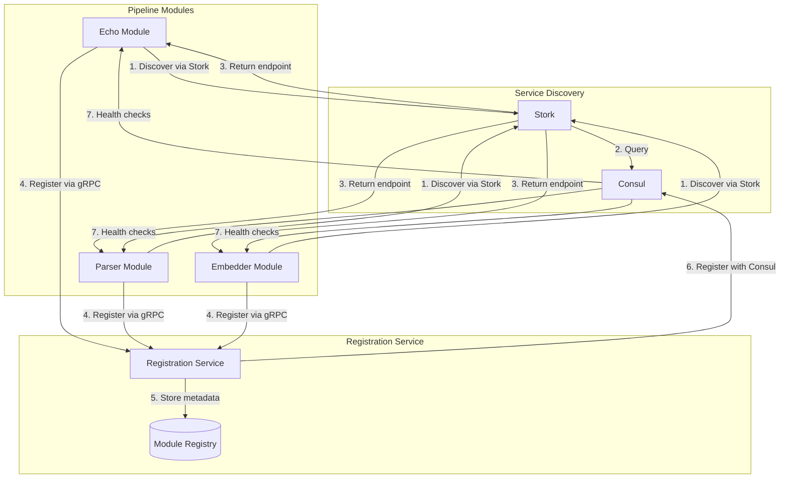
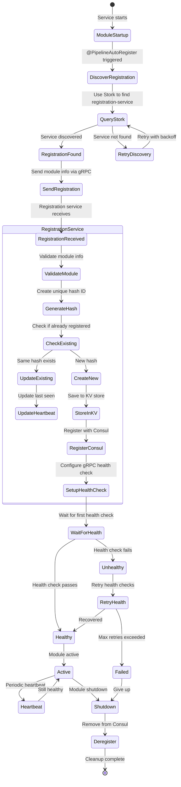

# Pipeline Module Registration Process

## Table of Contents
1. [Quick Start - Adding Registration to Your gRPC Service](#quick-start---adding-registration-to-your-grpc-service)
2. [Architecture Overview](#architecture-overview)
3. [Registration Flow](#registration-flow)
4. [Naming Conventions](#naming-conventions)
5. [State Management](#state-management)
6. [Version Tracking](#version-tracking)
7. [Service Discovery](#service-discovery)
8. [Health Monitoring](#health-monitoring)
9. [Configuration](#configuration)
10. [Troubleshooting](#troubleshooting)

## Quick Start - Adding Registration to Your gRPC Service

### Step 1: Add Dependencies

Add these dependencies to your module's `build.gradle.kts`:

```kotlin
dependencies {
    implementation(project(":libraries:pipeline-api"))
    implementation(project(":grpc-stubs"))
    
    // For service discovery
    implementation("io.quarkus:quarkus-smallrye-stork")
    implementation("io.smallrye.stork:stork-service-discovery-consul")
    implementation("io.smallrye.reactive:smallrye-mutiny-vertx-consul-client")
}
```

### Step 2: Implement PipeStepProcessor Interface

```java
import com.rokkon.search.sdk.PipeStepProcessor;
import com.rokkon.pipeline.api.annotation.PipelineAutoRegister;
import io.quarkus.grpc.GrpcService;
import jakarta.inject.Singleton;
import org.eclipse.microprofile.config.inject.ConfigProperty;

@GrpcService
@Singleton
@PipelineAutoRegister(
    moduleType = "processor",           // Type of module
    useHttpPort = true,                 // Use unified HTTP/gRPC port
    metadata = {                        // Additional metadata
        "category=data-processing",
        "complexity=simple"
    }
)
public class MyProcessorService implements PipeStepProcessor {
    
    @ConfigProperty(name = "quarkus.application.name")
    String applicationName;
    
    @Override
    public Uni<ProcessResponse> processData(ProcessRequest request) {
        // Your processing logic here
    }
    
    @Override
    public Uni<ServiceRegistrationResponse> getServiceRegistration(
            RegistrationRequest request) {
        return Uni.createFrom().item(
            ServiceRegistrationResponse.newBuilder()
                .setModuleName(applicationName)
                .setVersion("1.0.0")
                .setDisplayName("My Processor Service")
                .setDescription("Processes data in the pipeline")
                .addTags("pipeline-module")
                .addTags("processor")
                .putMetadata("author", "Your Team")
                .build()
        );
    }
}
```

### Step 3: Configure Service Discovery

Add to your `application.properties`:

```properties
# Service name (clean, no -module suffix)
quarkus.application.name=my-processor

# Unified HTTP/gRPC server
quarkus.http.port=39100
quarkus.grpc.server.use-separate-server=false

# gRPC client for registration service
quarkus.grpc.clients.registration-service.host=registration-service
quarkus.grpc.clients.registration-service.port=39100

# Stork service discovery
quarkus.stork.registration-service.service-discovery.type=consul
quarkus.stork.registration-service.service-discovery.consul-host=${CONSUL_HOST:consul}
quarkus.stork.registration-service.service-discovery.consul-port=${CONSUL_PORT:8500}
```

### Step 4: Docker Environment Variables

In your `docker-compose.yml`:

```yaml
services:
  my-processor:
    environment:
      - CONSUL_HOST=consul
      - CONSUL_PORT=8500
      - MODULE_HOST=my-processor  # Used for registration
      - QUARKUS_GRPC_SERVER_USE_SEPARATE_SERVER=false
```

That's it! Your service will automatically register on startup.

## Architecture Overview

The registration system follows a centralized architecture where:

1. **Modules** are gRPC services that process data in the pipeline
2. **Registration Service** is the central authority managing all registrations
3. **Consul** provides service discovery and health monitoring
4. **No direct Consul dependency** for modules - they only know about the registration service



## Registration Flow

### State Diagram



### Detailed Flow Steps

1. **Module Startup**
   - Module starts with `@PipelineAutoRegister` annotation
   - `PipelineAutoRegistrationBean` observes startup event
   - Collects module metadata (host, port, type)

2. **Service Discovery**
   - Uses Stork to discover registration service
   - Stork queries Consul for "registration-service"
   - Returns healthy instance endpoint

3. **Registration Request**
   - Module calls registration service via gRPC
   - Sends `ModuleInfo` with metadata
   - Registration service calls back to get detailed info

4. **Validation & Storage**
   - Registration service validates module data
   - Generates unique hash from host+port+schema+metadata
   - Stores in Consul KV with status REGISTERING

5. **Consul Registration**
   - Creates Consul service entry
   - Sets up gRPC health check
   - Tags service appropriately

6. **Health Monitoring**
   - Consul performs periodic gRPC health checks
   - Updates service status
   - Registration service updates KV status to HEALTHY

## Naming Conventions

### Service Names
- **Clean names**: `echo`, `parser`, `embedder`
- **No suffixes**: Avoid `-module`, `-service`, `-processor`
- **Lowercase**: Always use lowercase
- **Hyphens for multi-word**: `document-parser`, `text-embedder`

### Service IDs
- **Format**: `{service-name}-{host}-{port}`
- **Example**: `echo-echo-container-39100`
- **Unique per instance**: Each container gets unique ID

### Consul Tags
- `pipeline-module` - Identifies pipeline components
- `grpc` - Indicates gRPC support
- `type:{moduleType}` - From @PipelineAutoRegister
- `version:{version}` - Module version

### Metadata Keys
- Standard keys: `version`, `author`, `description`
- Module-specific: `schema-version`, `capabilities`
- Performance: `max-throughput`, `resource-requirements`

## State Management

### Module States

| State | Description | Next States |
|-------|-------------|-------------|
| `RECEIVED` | Registration request received | `REGISTERING`, `FAILED` |
| `REGISTERING` | Being registered with Consul | `REGISTERED`, `FAILED` |
| `REGISTERED` | Successfully registered, awaiting health | `HEALTHY`, `UNHEALTHY` |
| `HEALTHY` | Passing health checks | `UNHEALTHY`, `DEREGISTERING` |
| `UNHEALTHY` | Failing health checks | `HEALTHY`, `FAILED` |
| `FAILED` | Registration failed | `DEREGISTERING` |
| `DEREGISTERING` | Being removed | `DEREGISTERED` |
| `DEREGISTERED` | Fully removed | - |

### State Transitions

```java
public enum ModuleStatus {
    RECEIVED,      // Initial state when registration received
    REGISTERING,   // In process of registering with Consul
    REGISTERED,    // Registered but health unknown
    HEALTHY,       // Registered and passing health checks
    UNHEALTHY,     // Registered but failing health checks
    FAILED,        // Registration or health checks failed
    DEREGISTERING, // Being removed from system
    DEREGISTERED   // Fully removed
}
```

## Version Tracking

### Version Philosophy

The module itself is the source of truth for its version. The registration service tracks and audits changes but respects the module's reported version.

### Version vs Instance Detection

```java
// Instance identifier (unique per container)
String instanceId = String.format("%s-%s-%d", moduleName, host, port);

// Version comes from the module itself
String version = serviceRegistrationResponse.getVersion();
```

**Key Distinctions**:
- **Port/Host changes** = Different instance, same version
- **Version changes** = Module explicitly changed its version
- **Metadata changes** = Audit for history, auto-revision only for significant changes
- **Schema changes** = Delegate to schema registry (future)

### Metadata Change Detection

```java
public class MetadataChangeHandler {
    // Fields that trigger auto-revision
    private static final Set<String> SIGNIFICANT_FIELDS = Set.of(
        "capabilities",
        "max-throughput", 
        "resource-requirements",
        "supported-formats"
    );
    
    // Fields that are audit-only
    private static final Set<String> AUDIT_ONLY_FIELDS = Set.of(
        "author",
        "lastModified",
        "buildNumber",
        "gitCommit",
        "description"
    );
    
    public VersionDecision handleMetadataChange(
            String reportedVersion, 
            Map<String, String> oldMeta, 
            Map<String, String> newMeta) {
        
        Set<String> changed = getChangedFields(oldMeta, newMeta);
        
        // Always audit
        auditChange(changed, oldMeta, newMeta);
        
        // Only increment revision for significant changes
        if (hasSignificantChange(changed)) {
            return VersionDecision.incrementRevision(reportedVersion);
        }
        
        return VersionDecision.keepVersion(reportedVersion);
    }
}
```

### Multi-Version Support

When multiple versions are running simultaneously:

```
Service: echo
├── v1.2.3 (2 instances)
│   ├── echo-host-a-39100
│   └── echo-host-c-39100
└── v1.2.4 (1 instance)
    └── echo-host-b-39100
```

**Client Behavior**:
- Request `echo` → Routes to latest (v1.2.4)
- Request `echo:1.2.3` → Load balances between host-a and host-c
- Dynamic-grpc handles version selection logic

### Version Storage Structure

```
/pipeline/modules/echo/
  ├── instances/
  │   ├── echo-host-a-39100/
  │   │   ├── version → "1.2.3"
  │   │   ├── metadata → {...}
  │   │   └── health → "HEALTHY"
  │   ├── echo-host-b-39100/
  │   │   ├── version → "1.2.4"
  │   │   ├── metadata → {...}
  │   │   └── health → "HEALTHY"
  │   └── echo-host-c-39100/
  │       ├── version → "1.2.3"
  │       ├── metadata → {...}
  │       └── health → "HEALTHY"
  ├── versions/
  │   ├── latest → "1.2.4"
  │   ├── active → ["1.2.3", "1.2.4"]
  │   └── history → [...]
  └── audit/
      ├── 2024-01-15T10:30:00Z → {field: "author", old: "alice", new: "bob", version: "1.2.3"}
      └── 2024-01-15T11:00:00Z → {field: "capabilities", old: [...], new: [...], version: "1.2.3→1.2.4"}
```

### Schema Version Management (Future)

Schema versioning will be delegated to a dedicated schema registry:

```java
// Future integration with Apicurio/AWS Glue
public class SchemaVersioning {
    @Inject
    SchemaRegistryClient schemaRegistry;
    
    public CompletionStage<SchemaValidation> validateSchema(
            String moduleName, 
            String schemaJson) {
        
        // Let schema registry handle versioning
        return schemaRegistry
            .getLatestSchema(moduleName)
            .thenCompose(latest -> 
                schemaRegistry.checkCompatibility(latest, schemaJson)
            );
    }
}
```

### Error States

**Schema Version Mismatch**:
```java
// ERROR STATE: Module reports v1.2.3 but has v2.0.0 schema
// This indicates misconfiguration and should fail registration
if (schemaVersion != null && !isCompatibleVersion(reportedVersion, schemaVersion)) {
    return RegistrationStatus.newBuilder()
        .setSuccess(false)
        .setMessage("Schema version mismatch: module reports " + reportedVersion + 
                   " but schema indicates " + schemaVersion)
        .setErrorCode("SCHEMA_VERSION_MISMATCH")
        .build();
}
```

**Future Handling**:
- Log error state for investigation
- Could allow override with `force-register` flag
- Schema registry will provide better compatibility checking

## Service Discovery

### For Modules

Modules use Stork for service discovery:

```yaml
# Stork configuration
quarkus.stork.registration-service.service-discovery.type=consul
quarkus.stork.registration-service.service-discovery.consul-host=consul
quarkus.stork.registration-service.service-discovery.consul-port=8500
```

### For Clients

Clients can discover modules via:

1. **Direct Consul query**:
   ```bash
   curl http://consul:8500/v1/catalog/service/echo
   ```

2. **Registration service API**:
   ```bash
   curl http://registration-service:39100/api/v1/modules
   ```

3. **Stork in code**:
   ```java
   @GrpcClient("stork://echo")
   MutinyPipeStepProcessorStub echoClient;
   ```

## Health Monitoring

### gRPC Health Checks

Consul performs health checks using gRPC Health protocol:

```protobuf
service Health {
  rpc Check(HealthCheckRequest) returns (HealthCheckResponse);
  rpc Watch(HealthCheckRequest) returns (stream HealthCheckResponse);
}
```

### Health Check Configuration

```java
CheckOptions checkOptions = new CheckOptions()
    .setName("Module Health Check")
    .setGrpc(registration.host() + ":" + registration.port() + "/grpc.health.v1.Health")
    .setInterval("10s")
    .setDeregisterAfter("30s");
```

### Health Status Propagation

1. Consul checks module health every 10s
2. After 3 failed checks → marks UNHEALTHY
3. After 30s of failures → deregisters service
4. Registration service updates module status in KV

## Configuration

### Module Configuration

```properties
# Required
quarkus.application.name=my-module
quarkus.http.port=39100

# Optional
module.version=1.0.0
module.metadata=key1=value1,key2=value2
module.auto-register.enabled=true
```

### Registration Service Configuration

```properties
# Consul connection
consul.host=consul
consul.port=8500

# Module management
module.cleanup.interval=PT30M
module.zombie.threshold=PT2M
module.health.check.interval=10s
module.health.check.timeout=30s
```

### Docker Environment

```yaml
environment:
  # Required
  - CONSUL_HOST=consul
  - CONSUL_PORT=8500
  - MODULE_HOST=${HOSTNAME}
  
  # Optional
  - MODULE_VERSION=1.0.0
  - MODULE_METADATA="env=prod,region=us-east"
```

## Troubleshooting

### Common Issues

1. **"UNAVAILABLE: io exception"**
   - Check network connectivity
   - Verify registration service is running
   - Check Stork configuration

2. **Module not appearing in Consul**
   - Check registration service logs
   - Verify module metadata is valid
   - Ensure health endpoint is implemented

3. **Stuck in REGISTERING state**
   - Check Consul connectivity
   - Verify no duplicate registrations
   - Check for validation errors

### Debug Commands

```bash
# Check if module is registered
curl http://consul:8500/v1/catalog/service/my-module

# Check module health
curl http://consul:8500/v1/health/service/my-module

# Check registration service logs
docker logs registration-service | grep my-module

# Test gRPC health endpoint
grpcurl -plaintext my-module:39100 grpc.health.v1.Health/Check

# Check Stork discovery
curl http://my-module:39100/q/stork/services
```

### Logging Configuration

Enable debug logging:

```properties
quarkus.log.category."com.rokkon.pipeline".level=DEBUG
quarkus.log.category."io.smallrye.stork".level=DEBUG
quarkus.log.category."io.grpc".level=DEBUG
```

## Why This Architecture?

### Benefits

1. **Centralized Management**: Single source of truth for all registrations
2. **No Consul Dependency**: Modules don't need Consul libraries
3. **Automatic Discovery**: Stork handles service discovery transparently
4. **Version Tracking**: Automatic detection of configuration changes
5. **Health Monitoring**: Built-in health checks and status tracking
6. **Scalability**: Multiple instances register under same service name
7. **Simplicity**: Just add an annotation to enable registration

### Design Decisions

1. **gRPC-First**: All communication uses gRPC for consistency
2. **Pull-Based Registration**: Registration service pulls module info
3. **Hash-Based Versioning**: Deterministic version detection
4. **Consul for Discovery**: Industry-standard service mesh
5. **Unified Ports**: Single port for both HTTP and gRPC (39100)

### Trade-offs

1. **Additional Hop**: Modules must go through registration service
   - *Mitigation*: Registration is one-time at startup
   
2. **Central Point of Failure**: Registration service is critical
   - *Mitigation*: Can run multiple instances
   
3. **Eventual Consistency**: Health status has slight delay
   - *Mitigation*: Acceptable for this use case

This architecture provides a clean, scalable solution for managing pipeline modules while keeping the modules themselves simple and focused on their core functionality.