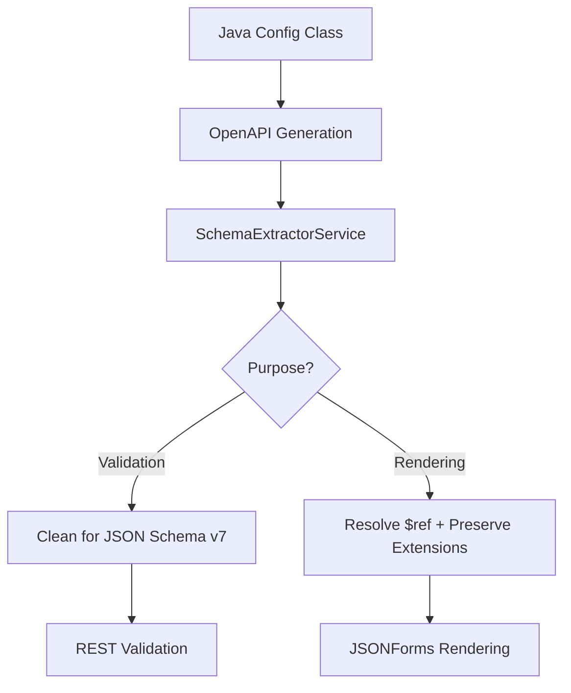

# Frontend Module Card Requirements and Architecture

## Executive Summary

This document outlines the requirements and architectural approach for implementing a 100% generic frontend module card system that can render any module's configuration while maintaining compatibility with JSON Schema v7 validation.

## Current State

### Working Components
- **ChunkerConfig**: ✅ Renders properly with flat schema structure
- **UniversalConfigCard**: ✅ Generic component working with JSONForms
- **Schema-driven approach**: ✅ Proven with chunker module

### Identified Issues
- **ParserConfig**: ❌ Shows empty boxes due to nested schema structure
- **OpenAPI $ref resolution**: ❌ References not expanded for frontend consumption
- **JSON Schema v7 compatibility**: ❌ Conflict between rendering needs and validation requirements

## Root Cause Analysis

### The Core Problem
The system has conflicting requirements between **frontend rendering** and **backend validation**:

1. **Frontend (JSONForms) needs**: Full schema with all nested properties expanded
2. **Backend (JSON Schema v7) needs**: Clean schema without OpenAPI-specific elements like `$ref`
3. **Current implementation**: Single schema extraction serves both needs → fails for nested schemas

### Technical Details

**Working (Chunker):**
```json
{
  "type": "object",
  "properties": {
    "algorithm": {"type": "string", "enum": ["character", "token"]},
    "chunkSize": {"type": "integer", "default": 1000}
  }
}
```

**Broken (Parser):**
```json
{
  "type": "object", 
  "properties": {
    "parsingOptions": {
      "$ref": "#/components/schemas/ParsingOptions",
      "type": "object",
      "description": "Core document parsing configuration"
    }
  }
}
```

After cleaning for JSON Schema v7:
```json
{
  "type": "object",
  "properties": {
    "parsingOptions": {
      "type": "object",
      "description": "Core document parsing configuration"
      // NO PROPERTIES! JSONForms can't render
    }
  }
}
```

## Requirements

### Functional Requirements

1. **100% Generic Rendering**
   - UniversalConfigCard works with any module without modification
   - No module-specific code or configuration required
   - Dynamic form generation from OpenAPI 3.1 schemas

2. **Schema-Driven Validation** 
   - JSON Schema v7 validation for REST endpoints
   - Runtime validation with detailed error messages
   - OpenAPI 3.1 native validation for gRPC services

3. **Developer Experience**
   - Single source of truth for configuration schema
   - No duplicate schema definitions
   - Automatic frontend form generation from Java annotations

4. **Production Requirements**
   - Fast rendering (no schema resolution delays)
   - Consistent validation across transport protocols
   - Maintainable architecture

### Technical Requirements

1. **Schema Resolution**
   - Resolve OpenAPI `$ref` references to inline schemas
   - Preserve OpenAPI extensions (x-hidden, x-display-order, etc.)
   - Maintain JSON Schema v7 compatibility for validation

2. **Transport Layer**
   - gRPC as single source of truth for schema extraction
   - REST endpoints proxy to gRPC for schema retrieval
   - No duplicate schema extraction logic

3. **Frontend Integration**
   - JSONForms compatible schemas with full property definitions
   - Support for nested object rendering
   - Example handling for different schema types (text vs config examples)

## Proposed Architecture

### 1. Dual Schema Extraction Strategy

**Current (Broken):**
```java
// Single method serves both needs - fails for complex schemas
public Optional<String> extractConfigSchemaForValidation() {
    return extractSchemaByName("ConfigName").map(this::cleanSchemaForJsonSchemaV7);
}
```

**Proposed (Fixed):**
```java
// Two methods, different processing strategies
public Optional<String> extractSchemaForValidation() {
    return extractSchemaByName("ConfigName").map(this::cleanForJsonSchemaV7);
}

public Optional<String> extractSchemaForRendering() {
    return extractSchemaByName("ConfigName").map(this::resolveReferencesForRendering);
}
```

### 2. gRPC-to-REST Proxy Pattern

**Current (Wrong):**
```java
// REST endpoint calls SchemaExtractorService directly
@GET @Path("/config")
public Response getConfig() {
    String schema = schemaExtractorService.extractConfigSchemaForValidation();
    return Response.ok(schema).build();
}
```

**Proposed (Right):**
```java
// REST endpoint proxies to gRPC
@GET @Path("/config") 
public Response getConfig() {
    String schema = grpcClient.extractSchema(); // Call gRPC method
    return Response.ok(schema).build();
}
```

### 3. Reference Resolution Algorithm

**Implementation Strategy:**
```java
private String resolveReferencesForRendering(String openApiSchema) {
    JsonObject schema = parseJson(openApiSchema);
    JsonObject fullDocument = getFullOpenApiDocument();
    
    return resolveReferences(schema, fullDocument, "/components/schemas");
}

private JsonObject resolveReferences(JsonObject schema, JsonObject document, String basePath) {
    // 1. Find all $ref properties
    // 2. Look up referenced schemas in document
    // 3. Inline the properties recursively
    // 4. Remove $ref property
    // 5. Preserve OpenAPI extensions (x-*)
    // 6. Return fully resolved schema
}
```

### 4. Schema Processing Pipeline



## Implementation Plan

### Phase 1: Architecture Foundation
1. **Add gRPC schema extraction methods** to all module services
2. **Update REST endpoints** to proxy gRPC calls instead of direct extraction
3. **Create reference resolution utility** in SchemaExtractorService

### Phase 2: Schema Resolution
1. **Implement resolveReferencesForRendering()** method
2. **Add extractSchemaForRendering()** to service interface  
3. **Update UniversalConfigCard** to use rendering endpoint

### Phase 3: Validation Compatibility
1. **Ensure JSON Schema v7 validation** still works for REST
2. **Add schema validation tests** for both rendering and validation modes
3. **Performance optimization** for schema resolution

### Phase 4: Production Readiness
1. **Add caching** for resolved schemas
2. **Error handling** for malformed schemas
3. **Monitoring and metrics** for schema extraction

## Success Criteria

### Immediate Goals
- [ ] Parser Config Card renders with proper form fields
- [ ] UniversalConfigCard works with any module schema
- [ ] REST validation continues working with JSON Schema v7

### Long-term Goals  
- [ ] Zero module-specific frontend code required
- [ ] New modules automatically get working Config Cards
- [ ] Single source of truth maintained across all transport layers

## Technical Considerations

### OpenAPI 3.1 + JSON Schema Compatibility
- OpenAPI 3.1 schemas should be JSON Schema compatible by design
- Edge cases may require custom handling
- Fallback strategies for unsupported schema features

### Performance Implications
- Schema resolution adds processing overhead
- Caching strategy needed for production
- Consider build-time vs runtime resolution

### Backward Compatibility
- Existing working modules (chunker) must continue working
- REST validation behavior must remain unchanged
- Migration path for modules with custom implementations

## Conclusion

The dual schema extraction strategy provides a clean path forward that satisfies both frontend rendering needs and backend validation requirements. By implementing proper `$ref` resolution for rendering while maintaining JSON Schema v7 compatibility for validation, we can achieve the goal of 100% generic module cards without sacrificing validation capabilities.

The key insight is that **different consumers need different schema formats** - recognizing this allows us to provide the right schema for the right purpose while maintaining a single source of truth in the OpenAPI specification.