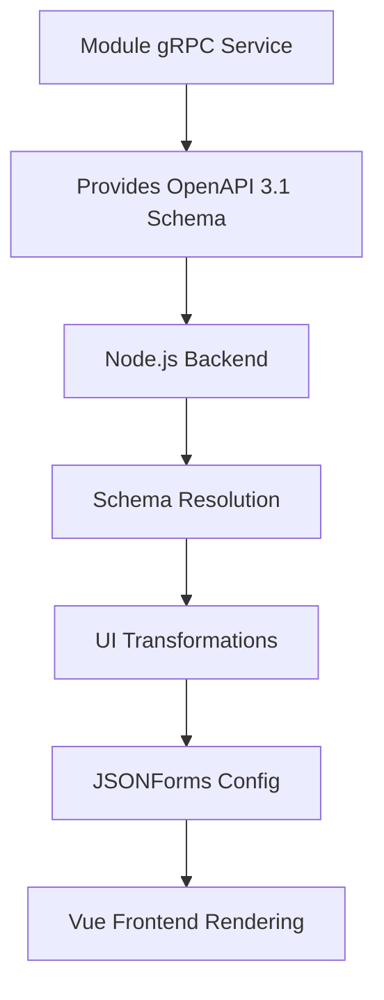

# Frontend Module Card Requirements and Architecture

## Executive Summary

This document outlines the requirements and architectural approach for implementing a 100% generic frontend module card system that can render any module's configuration. The system uses a single `json_config_schema` field from the module's gRPC service as the source of truth for both UI rendering and validation.

## Current State

### Working Components
- **ChunkerConfig**: ✅ Renders properly with flat schema structure
- **UniversalConfigCard**: ✅ Generic component working with JSONForms
- **Schema-driven approach**: ✅ Proven with chunker module

### Identified Issues
- **ParserConfig**: ❌ Shows empty boxes due to nested schema structure
- **OpenAPI $ref resolution**: ❌ References not expanded for frontend consumption
- **JSON Schema v7 compatibility**: ❌ Conflict between rendering needs and validation requirements

## Root Cause Analysis

### The Core Problem
The system has conflicting requirements between **frontend rendering** and **backend validation**:

1. **Frontend (JSONForms) needs**: Full schema with all nested properties expanded
2. **Backend (JSON Schema v7) needs**: Clean schema without OpenAPI-specific elements like `$ref`
3. **Current implementation**: Single schema extraction serves both needs → fails for nested schemas

### Technical Details

**Working (Chunker):**
```json
{
  "type": "object",
  "properties": {
    "algorithm": {"type": "string", "enum": ["character", "token"]},
    "chunkSize": {"type": "integer", "default": 1000}
  }
}
```

**Broken (Parser):**
```json
{
  "type": "object", 
  "properties": {
    "parsingOptions": {
      "$ref": "#/components/schemas/ParsingOptions",
      "type": "object",
      "description": "Core document parsing configuration"
    }
  }
}
```

After cleaning for JSON Schema v7:
```json
{
  "type": "object",
  "properties": {
    "parsingOptions": {
      "type": "object",
      "description": "Core document parsing configuration"
      // NO PROPERTIES! JSONForms can't render
    }
  }
}
```

## Requirements

### Functional Requirements

1. **100% Generic Rendering**
   - UniversalConfigCard works with any module without modification
   - No module-specific code or configuration required
   - Dynamic form generation from OpenAPI 3.1 schemas

2. **Schema-Driven Validation** 
   - JSON Schema v7 validation for REST endpoints
   - Runtime validation with detailed error messages
   - OpenAPI 3.1 native validation for gRPC services

3. **Developer Experience**
   - Single source of truth for configuration schema
   - No duplicate schema definitions
   - Automatic frontend form generation from Java annotations

4. **Production Requirements**
   - Fast rendering (no schema resolution delays)
   - Consistent validation across transport protocols
   - Maintainable architecture

### Technical Requirements

1. **Schema Resolution**
   - Resolve OpenAPI `$ref` references to inline schemas
   - Preserve OpenAPI extensions (x-hidden, x-display-order, etc.)
   - Maintain JSON Schema v7 compatibility for validation

2. **Transport Layer**
   - gRPC as single source of truth for schema extraction
   - REST endpoints proxy to gRPC for schema retrieval
   - No duplicate schema extraction logic

3. **Frontend Integration**
   - JSONForms compatible schemas with full property definitions
   - Support for nested object rendering
   - Example handling for different schema types (text vs config examples)

## Proposed Architecture

### 1. Single Schema Field Contract

**Module Contract:**
- Modules provide schema via `json_config_schema` field in `ServiceRegistrationResponse`
- Field is OPTIONAL - if missing, UI shows generic key/value editor
- Schema should be valid OpenAPI 3.1 format
- This is a non-breaking addition to existing modules

**Migration Strategy:**
- Phase 1: Add `json_config_schema` alongside existing validation (NOW)
- Phase 2: Switch REST validation to use `json_config_schema` (AFTER frontend complete)
- Phase 3: Remove old schema extraction code (CLEANUP)

**Developer Tool Responsibilities:**
- Transform OpenAPI schemas for UI rendering
- Provide fallback key/value editor for modules without schemas
- Handle schema resolution and enhancement
- Enable testing with real protobuf data

### 2. Schema Transformation in Node.js

**Developer Tool Architecture:**
```
Module (gRPC) → Node.js Backend → Vue Frontend
                     ↓
              - Schema resolution
              - UI transformations
              - JSONForms config
```

**Transformation Pipeline:**
1. Receive OpenAPI 3.1 schema from module
2. Resolve all `$ref` references
3. Apply UI enhancements (widgets, layout, help text)
4. Fix JSONForms compatibility issues
5. Output optimized configuration for rendering

### 3. Reference Resolution in Node.js

**Implementation using TypeScript:**
```typescript
// In the Node.js backend
import RefParser from '@apidevtools/json-schema-ref-parser';

async function transformSchemaForUI(rawSchema: string): Promise<object> {
    // Step 1: Parse and resolve references
    const parsed = JSON.parse(rawSchema);
    const resolved = await RefParser.dereference(parsed);
    
    // Step 2: Apply UI transformations
    const enhanced = applyUIEnhancements(resolved);
    
    // Step 3: Fix JSONForms compatibility
    const compatible = ensureJSONFormsCompatibility(enhanced);
    
    return compatible;
}

function applyUIEnhancements(schema: any): any {
    // Add UI hints, layout, widget types, etc.
    // Without breaking OpenAPI 3.1 validity
}
```

### 4. Schema Processing Pipeline



## Implementation Plan

### Phase 1: Developer Tool Foundation (CURRENT)
1. ✅ **Set up Node.js/Express backend** with TypeScript in `applications/node/dev-tools`
2. ✅ **Implement gRPC client** to connect to modules
3. ✅ **Create schema transformation pipeline** with reference resolution
4. ✅ **Build Vue 3 frontend** with module connection UI
5. **Fix remaining modules** (Echo needs schema, Chunker needs OpenAPI format)
6. **Add key/value fallback** for modules without schemas
7. **Implement .bin file loading** for testing with real protobuf data

### Phase 2: Sample Data Pipeline
1. **Create Java helper** to generate initial ModuleProcessRequest .bin files
2. **Add file browser** in dev tool to load .bin files
3. **Implement pipeline chaining** - output of one module becomes input to next
4. **Save intermediate results** as new .bin files
5. **Build complete test dataset** for all modules

### Phase 3: Component Packaging
1. **Extract UniversalConfigCard** as NPM package
2. **Package schema transformation utilities**
3. **Document component API** and usage
4. **Publish to internal registry**

### Phase 4: Module Integration
1. **Add to one module first** (Echo as proof of concept)
2. **Integrate with Quinoa** for Vue frontend
3. **Roll out to all modules**
4. **Deprecate old validation approach**

### Phase 5: Migration Completion
1. **Switch REST validation** to use `json_config_schema`
2. **Remove old schema extraction code**
3. **Update all tests** to use new approach
4. **Documentation and cleanup**

## Success Criteria

### Immediate Goals
- [ ] Parser Config Card renders with proper form fields
- [ ] UniversalConfigCard works with any module schema
- [ ] REST validation continues working with JSON Schema v7

### Long-term Goals  
- [ ] Zero module-specific frontend code required
- [ ] New modules automatically get working Config Cards
- [ ] Single source of truth maintained across all transport layers

## Technical Considerations

### OpenAPI 3.1 + JSON Schema Compatibility
- OpenAPI 3.1 schemas should be JSON Schema compatible by design
- Edge cases may require custom handling
- Fallback strategies for unsupported schema features

### Performance Implications
- Schema resolution adds processing overhead
- Caching strategy needed for production
- Consider build-time vs runtime resolution

### Backward Compatibility
- Existing working modules (chunker) must continue working
- REST validation behavior must remain unchanged
- Migration path for modules with custom implementations

## Conclusion

The dual schema extraction strategy provides a clean path forward that satisfies both frontend rendering needs and backend validation requirements. By implementing proper `$ref` resolution for rendering while maintaining JSON Schema v7 compatibility for validation, we can achieve the goal of 100% generic module cards without sacrificing validation capabilities.

The key insight is that **different consumers need different schema formats** - recognizing this allows us to provide the right schema for the right purpose while maintaining a single source of truth in the OpenAPI specification.